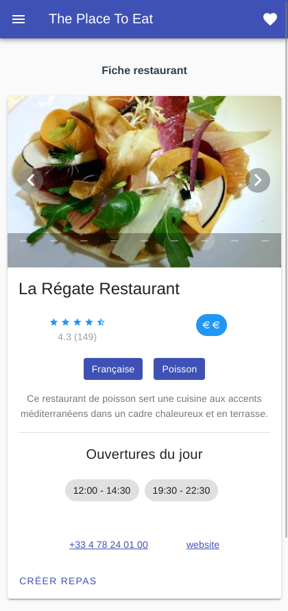
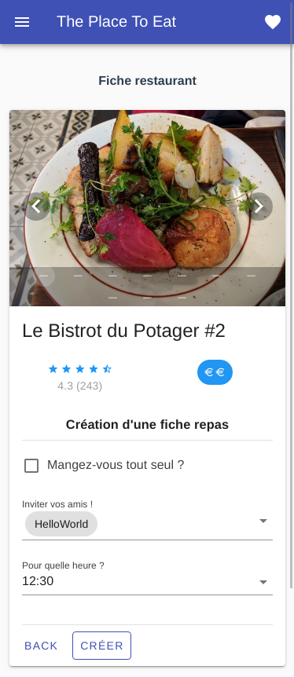
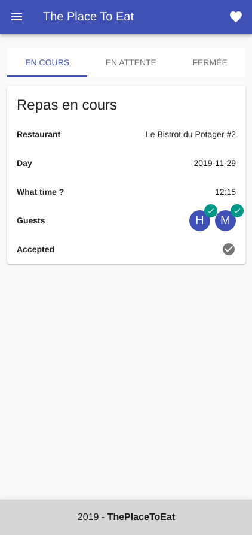

# PWA Project: ThePlaceToEat






##  Description:

ThePlaceToEat is an app to recommand restaurants to users every day. Datas are
provided by Google Places API.
This is a school project but with a relatively scalable and powerful architecture.
This is an example of how to setup a Django / VueJS / Nginx app with docker and 
docker-compose to build a PWA (Progressive Web Application).

##  Technical tools:

*  Backend: Django 2 (with DjangoRestFramework), Celery, Redis.
*  Frontend: VueJS / Vuetify.
*  Database: Postgresql
*  Web Server: Nginx with automatic HTTPS using letsencrypt container.
*  Dockerized application.

## Start the project locally

### 1.  Environment Variables:

Create a .env file in both frontend and backend folder and copy those env
variables to it.

##### Backend:

| Variable Name | Value |
| ------ | ------ |
| POSTGRES_DB | Database name |
| POSTGRES_USER | Database user |
| HOST | Database host | 
| DJANGO_SECRET_KEY | Django App Secret key | 
| DJANGO_ALLOWED_HOSTS | Authorized hosts for your django app | 
| GOOGLE_API_KEY | A valid Google Places Api Key |

##### Frontend:

| Variable Name | Value |
| ------ | ------ |
| VUE_APP_BACK_BASE_URL | Backend API URL |

### 2.  Docker commands:

`docker-compose` is used to start either the development or production version.
For production, run the following:

```
docker-compose up --build
```

For local development (hot reloading on the Vue and Django applications),
run the following commnad:

```
docker-compose -f docker-compose.dev.yml up --build
```

### 3.  Post installation:

##### Apply migrations:

```
docker-compose exec backend ./manage.py migrate
```

### 4.  Application routes:

**Frontend** is now accessible at *http://localhost:8080/*
**Backend** is now accessible at *http://localhost/api/*
